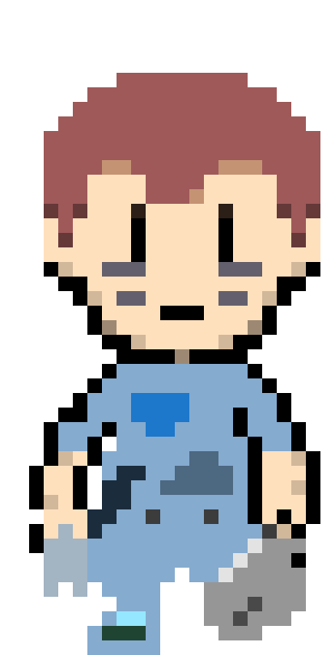
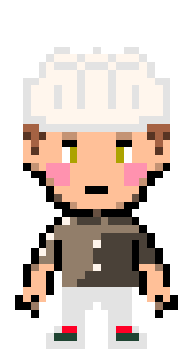
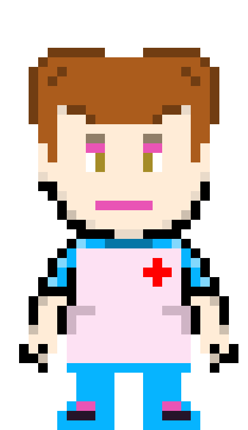
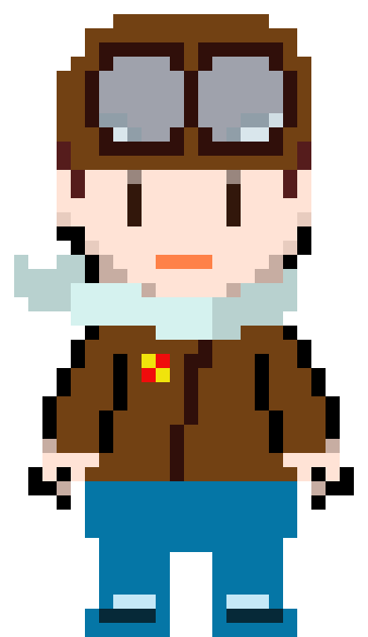

# SpaceCamp
a game made in [engo](https://engoengine.github.io) for the
[Game Off 2020](https://itch.io/jam/game-off-2020)!

# Can you make it to the moon?

You work for a big, important space-age space exploration company, OriginX!
Build your team of brave space explorers, gather supplies, and lead your team
on an out of this world adventure on your company's flagship manned mission to
Mars! Can you survive the perilous journey?

# How to play!

Use WASD to move around and j, k, l, and ; to interact/select/etc.

Press F4 on the opening screen to enable full screen, and hold escape for three
seconds at any time to leave the game.

# CHARACTERS!

Here's a list of the Characters and their stuffs!

## Mechanic

ATK : 5
DEF : 5
SPD : 5

The mechanic is a pretty decent all-around character. He gets bonuses to fixing
things around the ship, making repairs, and restocking oxygen.

## Xeno Biologist

ATK : 1
DEF : 3
SPD : 5

The Xenobiologist isn't the best combatant, and has some trouble getting chores
done around the ship. However, if you encounter an alien you definitely want
one on your crew!

## Chef

ATK : 6
DEF : 6
SPD : 3

The Chef really knows how to fill bellies. Use less food stores, and your crew
will be happier! A Chef is really a must-have for any crew!

## Security

ATK : 8
DEF : 8
SPD : 5

Security is definitely an important part of the mission. Anything can happen
out there, and having someone around who knows how to fight is always useful.

## Medic

ATK : 3
DEF : 6
SPD : 6

If anyone gets injured, you'll definitely wish you'd brought a medic! Not only
will a first-aid kit last longer, but medics can heal faster to boot!

## Pilot

ATK : 5
DEF : 4
SPD : 5

If communications, navigation, or auto-pilot goes down, the Pilot will help
you get to your destination fastest!

### Notes

All the assets are open and freely available (most of them are made by me!),
but due to binary size I don't want to include the raw assets in the repo. If
you need a copy to build this, feel free to email me and I can get them for you!
